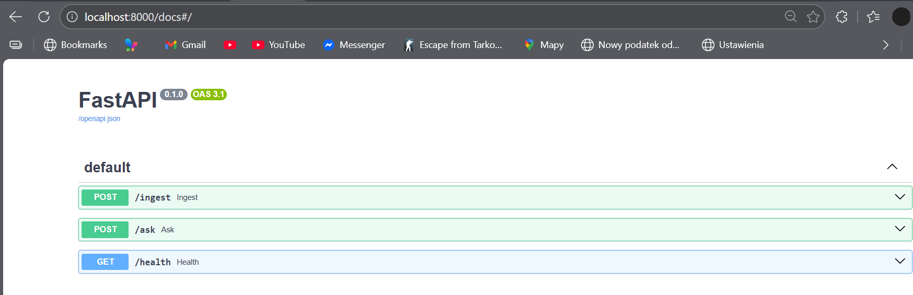
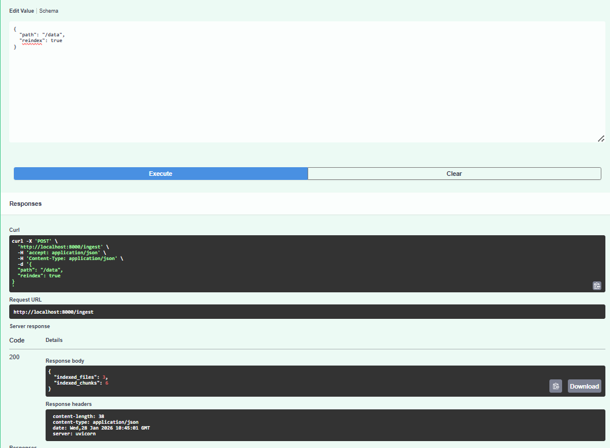
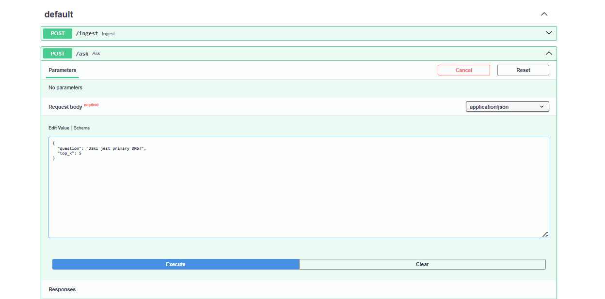
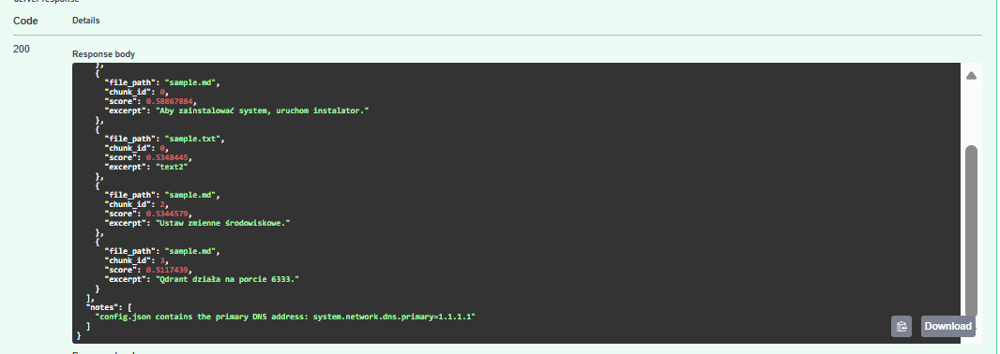
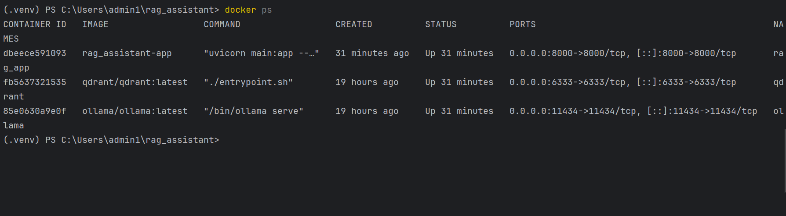
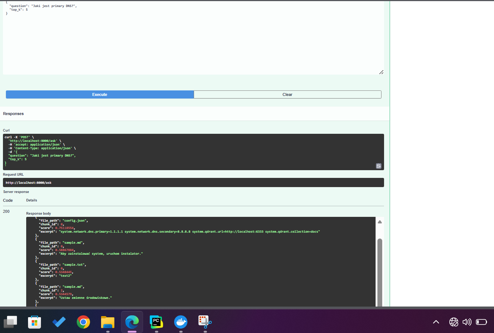

## Local Technical RAG Assistant (Offline)

A local Retrieval-Augmented Generation (RAG) assistant designed for analyzing and consulting technical system documentation.
The application works fully offline, communicates exclusively via JSON, and runs inside Docker on Linux (via WSL2 on Windows).

## Project Goal

The goal of this project is to build a local technical assistant that:

analyzes technical documentation (JSON, Markdown, TXT)

stores knowledge in a Qdrant vector database

answers user questions using a local LLM (Ollama)

communicates only through JSON

works fully offline

runs in a Dockerized environment

## RAG flow:

Documents are loaded and split into chunks

Text chunks are embedded and stored in Qdrant

User question is embedded and matched against stored vectors

Relevant context is built from top-k results

Local LLM (Ollama) generates a JSON-only response based on the context

##  Docker & Environment

The application runs using Docker Compose and consists of three services:

rag_app – FastAPI backend (RAG logic)

qdrant – vector database

ollama – local LLM runtime

## Indexing Documentation (/ingest)

The /ingest endpoint loads and indexes documentation files.

Example request:
{
  "path": "/data",
  "reindex": true
}

 
## Asking Questions (/ask)

The /ask endpoint allows querying the indexed documentation.

Example request:
{
  "question": "What is the primary DNS?",
  "top_k": 5
}

Example response:
{
  "answer": "The primary DNS is 1.1.1.1.",
  "confidence": 0.92,
  "sources": [
    {
      "file_path": "config.json",
      "chunk_id": 0,
      "score": 0.87,
      "excerpt": "Primary DNS is set to 1.1.1.1."
    }
  ]
}

## JSON-Only Communication

All endpoints accept and return JSON only

The LLM is strictly instructed to return valid JSON

Responses are validated using Pydantic

Fallback JSON is returned if the model output is invalid

## Offline Mode

The LLM model is downloaded once

No external APIs are used

After setup, the application works without internet access

## Summary
Summary

This project demonstrates a fully local, offline RAG system for technical documentation analysis.
It combines modern vector search, local LLM inference, and containerized deployment while ensuring
strict JSON-based communication.

## Screenshoots

